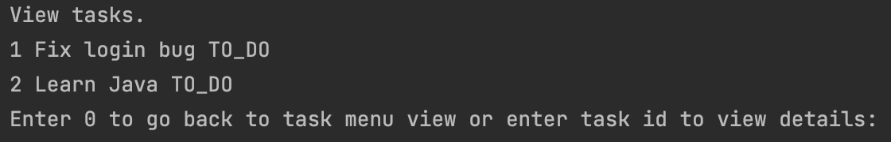

# TODO APP - Java app

### Tech stack: Java & Postgresql

## 1. Database design


### DB Scripts:
```
create Table APP_USER(
ID INT PRIMARY KEY,
NAME VARCHAR(50) NOT NULL,
PASSWORD VARCHAR(100) NOT NULL,
CREATED_AT TIMESTAMP
);
```

```
create Table TASK(
ID INT PRIMARY KEY,
NAME VARCHAR(50) NOT NULL,
DESCRIPTION VARCHAR(700) NOT NULL,
USER_ID INT,
DUE_DATE TIMESTAMP,
STATUS VARCHAR(30),
CREATED_AT TIMESTAMP,
FINISHED_AT TIMESTAMP,
FOREIGN KEY(USER_ID) REFERENCES APP_USER(ID)
);
```

### Views:

#### 1. Home View


User can Log in, Sign up or exit from app

### 2. Sign up View


In the sign up view, user can sign up. 
The app will ask for a name and password, and then the user will be saved in the "USER" table. The password will be stored encrypted with the BCrypt algorithm.


### 3. Log in View


In the log in view, users can log in into the app.
The password entered by the user will be checked if matched the one in the database using BCrypt.checkpw(plainPassword, dbPassword);

If users doesn't exist it will be shown "User doesn't exist!".
If the password is not correct it will be shown "Password is not correct".

### 4. Task Menu View


In the task menu View, users can choose between creating a new task or view all tasks.

### 5. Task creation View


In the Task creation View the user can add a new task. He will need to enter the task name, a description and a due date.
The task will be inserted in the database with the "To do" status.


### 6. View tasks View



In this view it will shown all tasks for the logged user.
And you can enter the task id to view details for selected task.


### 7. Detailed task View


In this view you can view all details about the task selected and you change the status and you can delete it.


